# Skin Cancer Diagnosis Tool
 

  <a href="#">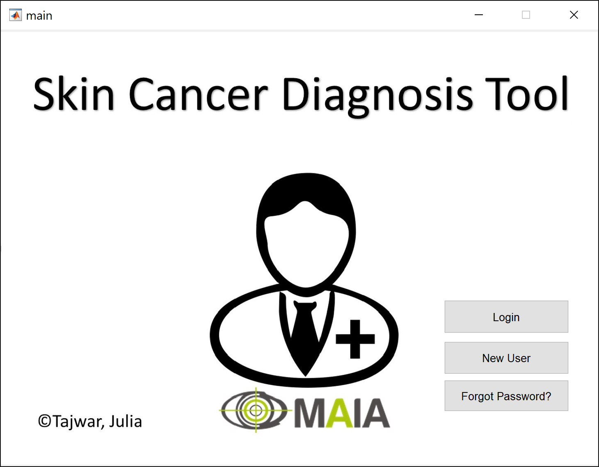</a>

This was developed as a requirement for e-Health course in Erasmus Mundus+ Joint Master Degree in Medical Imaging and Applications ([MAIA](https://maiamaster.udg.edu/)). 

## Prerequisites

## Summary
A toolkit for analyzing RGB skin images and diagnosing the presence of cancer. A minimalistic easy to use UI was developed using MatLab’s built-in GUI designer called GUIDE. This app was designed not to make the final diagnosis but to provide users with a simple tool to take and manage images of suspected skin areas and let their doctor make the final diagnosis. When registering an account, information about the user's doctor is also taken. After images are taken, the initial diagnosis and the image taken are sent to the doctor directly and the doctor then decides the final diagnosis. The toolkit also lets the user to see the results if they would like to. The diagnosis of cancer is based on a pre-trained  AlexNet that was trained using skin cancer data from [ISIC 2017 Challenge](https://challenge.isic-archive.com/landing/2017/). 

## Usage

* Download the pretrained network weights from [here](https://drive.google.com/file/d/1d-uXMO1GISsSch4MHP0MSWwo3LBtmJe2/view?usp=sharing). Or train your own network by modifying `classification_net.m` and save the weights as `Classification_net.mat`. I suggest training your own network as there are much more publicly available data for skin cancer now. 

* Modify the credentials of the email address you would like to use to sent emails on `email_settings.m`

* Run `main.m` to open the homepage of the UI. 

## UI Details

Upon running the `main.m`, the homepage will show up.

For new users, they can sign up by clicking the `New User` button. First, the toolkit will ask for information about the user

<a href="#">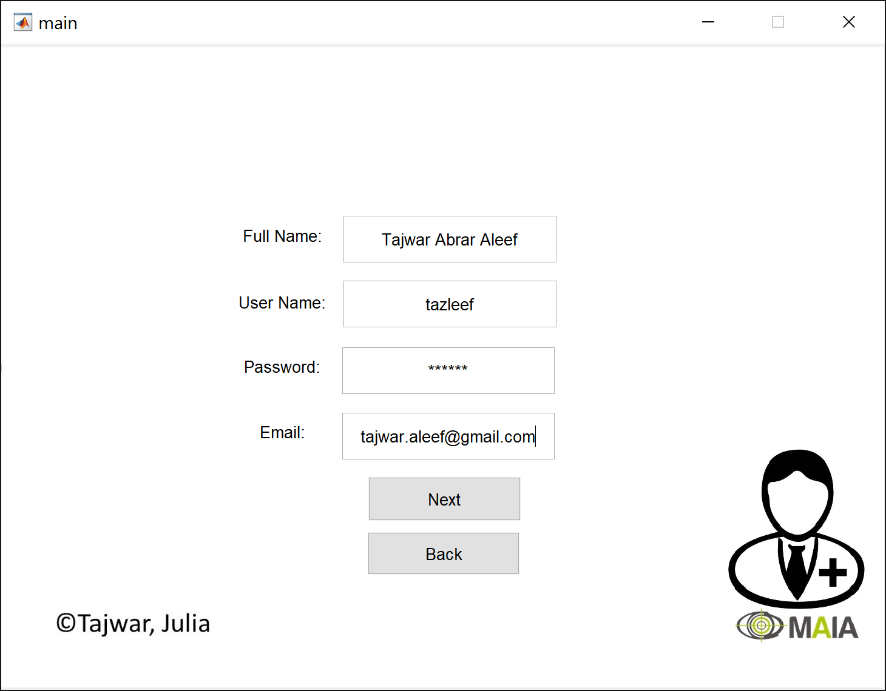</a>

followed by the information of the user' Doctor.

<a href="#">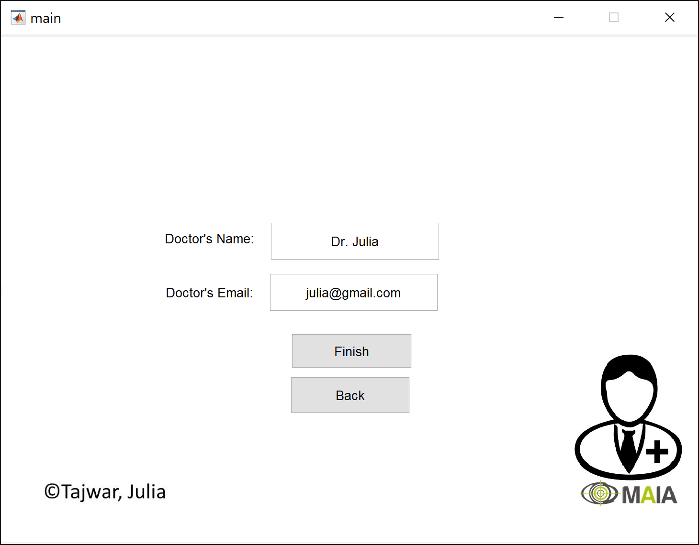</a>

Now the user can log in by clicking the `Log in` button and using their credentials.

<a href="#">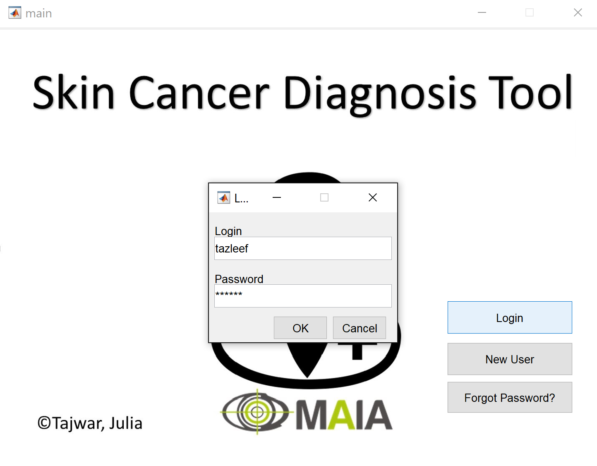</a>

If the user forgets their password, they can recover it by clicking the `Forget Password?` button and providing their email address.

<a href="#">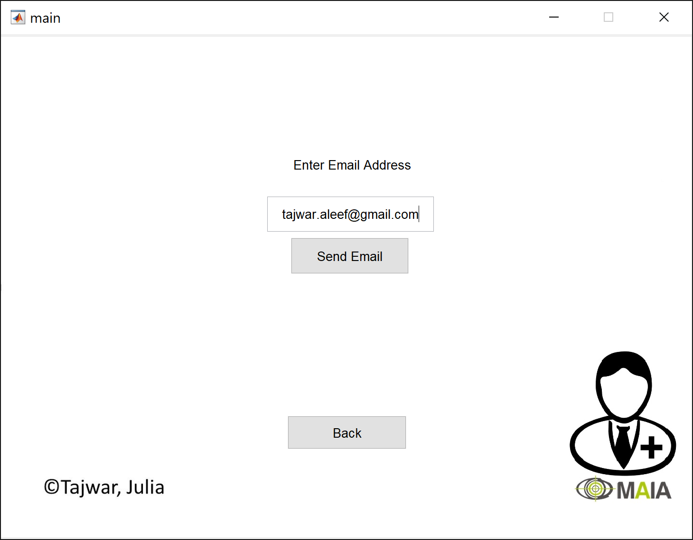</a>

After logging in the user can take a new image, load an image from disk, or view their previous results with images.

<a href="#">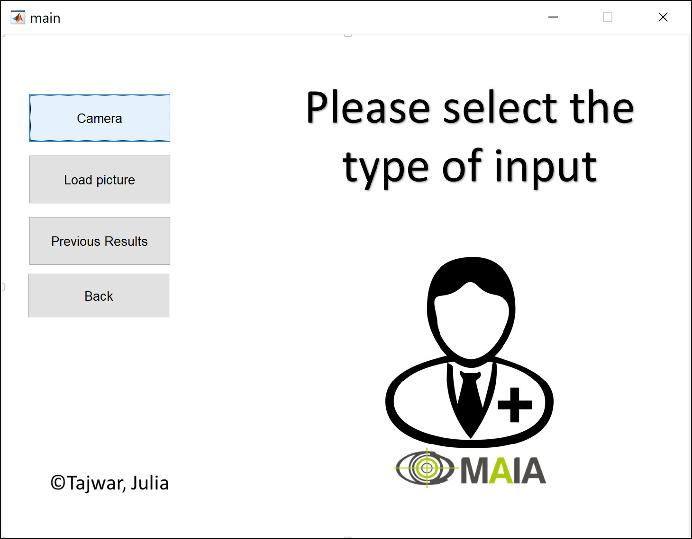</a>

To take a new picture, the `Camera` button needs to be pressed. This will open up their webcam or any other higher-end camera connected to their system. Currently, the code is set up to use the camera with id-0.

<a href="#">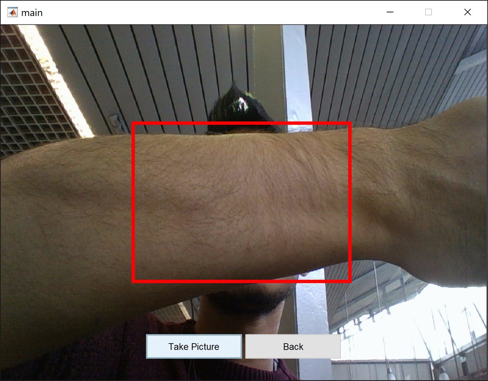</a>

To load an image from disk, press `Load picture`.

<a href="#">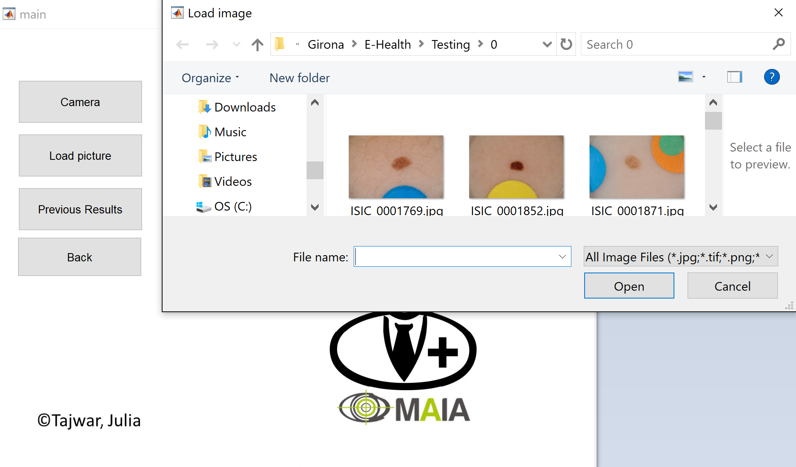</a>

After the image is selected, the toolkit offers some simple pre-processing which includes adjusting the brightness and contrast of the image. The user can also select a region of interest and crop the image if needed.

<a href="#">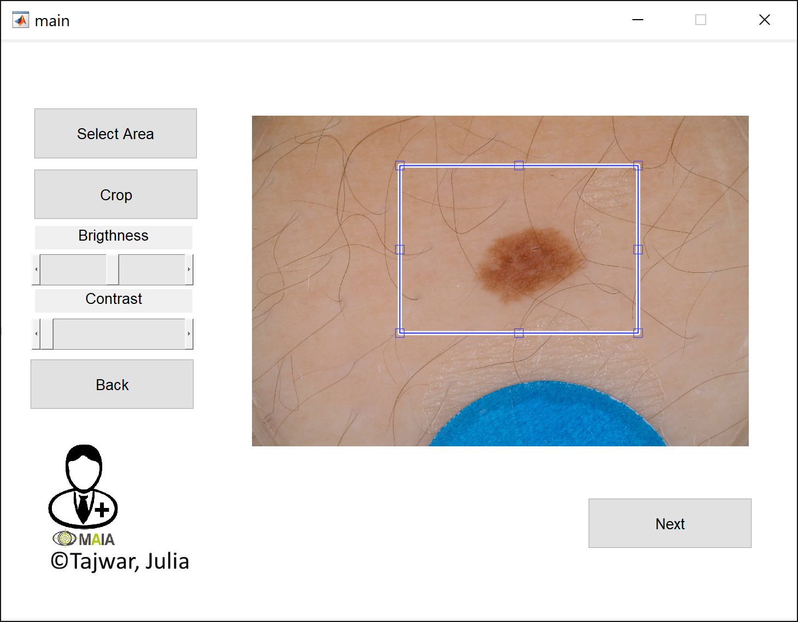</a>

After pressing `Next`, now the toolkit passes the processed image to the backend where the neural network classifies the image. The result page doesn't show the results immediately and prompts the user to contact their Doctor who has received the diagnosis with the image. 

<a href="#">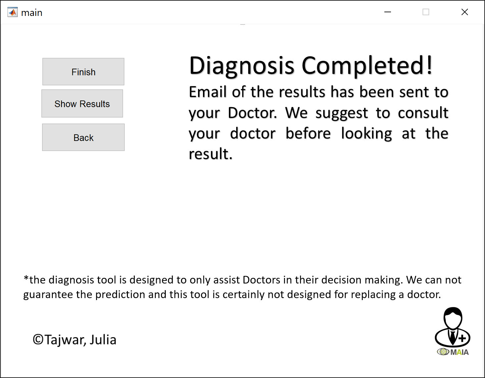</a>

A snapshot of what the Doctor receives.

<a href="#">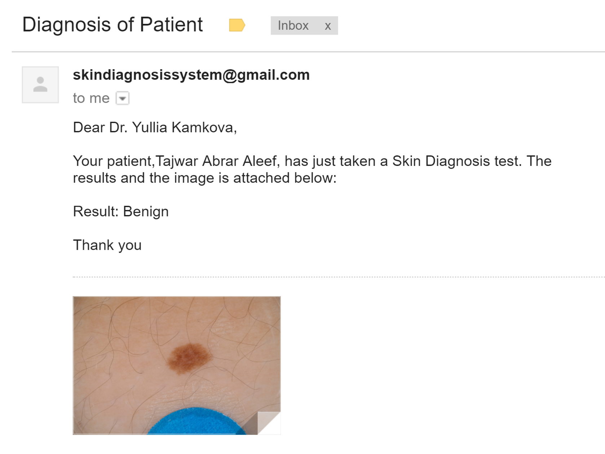</a>

If the user still wants to see the diagnosis of the toolkit, they can click `Show Results`.

<a href="#">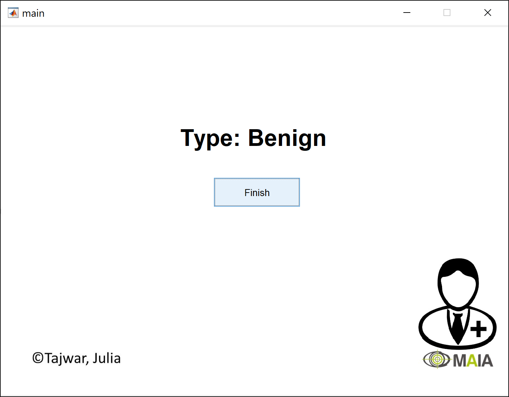</a>

Finally, the toolkit has many check functions and warnings that prevent the UI from crashing if incorrect information is provided.

<a href="#">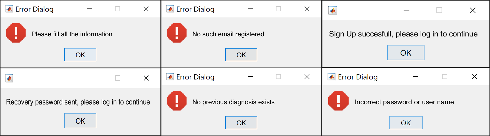</a>

## Contributing & Contact 

Send a pull request if you would like to contribute. If you face any problem using this code then please create an issue in this repository or contact me at [tajwaraleef@ece.ubc.ca](mailto:tajwaraleef@ece.ubc.ca?subject=[GitHub]%20SkinCancerDiagnosisTool%20Issue%20)

## License
MIT

